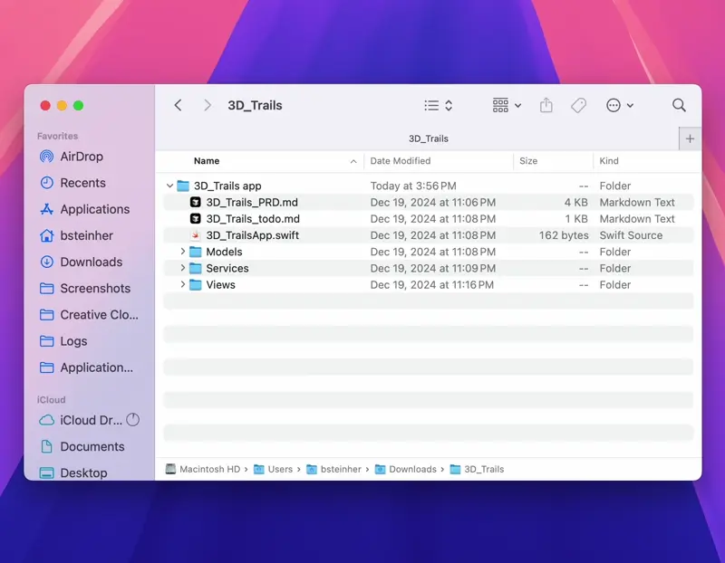
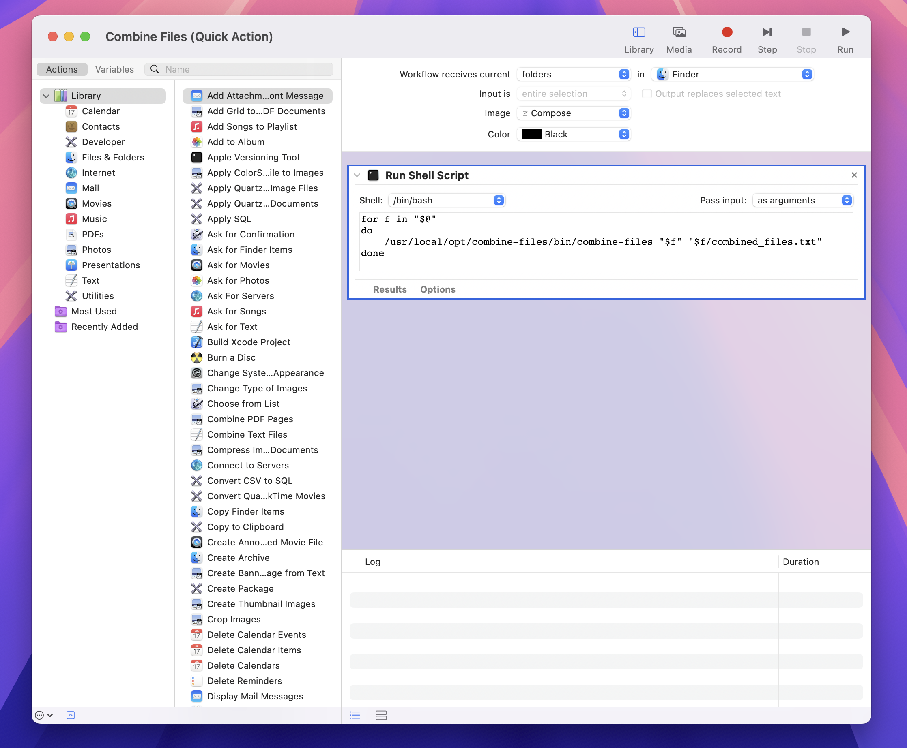

# Combine Files - macOS Quick Action

A tool to combine all text files from a directory into a single document, with a convenient Quick Action for Finder integration.



## Features

- 🌳 Generates a file tree visualization
- 📝 Combines content from text files
- ⚡️ Quick Action integration in Finder
- 🔍 Smart text file detection
- ⚙️ Configurable file exclusions
- 📊 Progress tracking
- 💻 Command-line interface

## Quick Start
```bash
# 1. Install
git clone https://github.com/human-bee/folder-to-single-file.git && cd folder-to-single-file
sudo ./install.sh

# 2. Use via Finder
# Right-click any folder → Quick Actions → Combine Files

# 3. Or use via command line
combine-files ~/Documents/my-project combined.txt
```

## Requirements

- macOS
- Python 3.6 or later
- No external dependencies - uses only Python standard library

## Repository Structure
```
combine-files/
├── assets/                   # Documentation media files
├── bin/
│   └── combine-files        # Main executable script
├── lib/
│   └── combine_files.py     # Core Python implementation
├── src/
│   └── combine_files_quick_action.sh  # Quick Action shell script
├── config/
│   └── default_excludes.txt # Default exclusion patterns
├── install.sh               # Installation script
├── .gitignore              # Git ignore patterns
├── requirements.txt         # Python requirements
├── LICENSE                 # MIT license
└── README.md               # This file
```

## Installation

1. Clone the repository:
```bash
git clone https://github.com/human-bee/folder-to-single-file.git
cd folder-to-single-file
```

2. Install using the installer script:
```bash
sudo ./install.sh
```

This will:
- Install the tool to `/usr/local/opt/combine-files`
- Create a symlink in `/usr/local/bin`
- Set up the Quick Action in Finder as shown below:



The Quick Action is configured to:
- Receive selected folders in Finder
- Use the entire selection as input
- Run a shell script that processes each selected folder
- Create a `combined_files.txt` in each processed folder

## Usage

### Via Quick Action
1. Right-click on any folder in Finder
2. Go to Quick Actions
3. Select "Combine Files"
4. A `combined_files.txt` will be created in the selected folder

### Via Command Line
```bash
# Basic usage
combine-files /path/to/folder output.txt

# Real-world examples
# Combine all markdown files for documentation
combine-files --exclude "!*.md" docs/ combined-docs.md

# Merge Python files for code review
combine-files --exclude "!*.py" "test_*.py" src/ code-review.txt

# Combine logs while excluding temp files
combine-files --exclude "*.tmp" "*.cache" logs/ combined-logs.txt
```

## Configuration

Default exclude patterns are stored in `/usr/local/opt/combine-files/config/default_excludes.txt`. 

Common default exclusions and why:
- `.git/*`: Version control files aren't relevant for combining
- `.DS_Store`: macOS system files
- `__pycache__`: Python bytecode cache
- `node_modules`: NPM dependencies
- `*.pyc`: Compiled Python files

Example custom exclude patterns:
```txt
# Exclude everything except markdown
!*.md

# Exclude temp files and logs
*.tmp
*.log
temp/*

# Complex pattern: exclude test files except integration tests
test_*.py
!integration_test_*.py
```

## Troubleshooting

### Common Issues

1. **Permission Denied**
   ```bash
   sudo chown -R $(whoami) /usr/local/opt/combine-files
   ```

2. **Quick Action Not Appearing**
   - Restart Finder: `killall Finder`
   - Check System Settings → Extensions → Finder Extensions

3. **File Too Large**
   - Use the `--max-size` option to adjust the file size limit
   - Split large directories into smaller chunks

4. **Encoding Issues**
   - The tool defaults to UTF-8
   - For other encodings, use `--encoding` option

### Getting Help
- Open an issue on GitHub
- Check the logs in `~/Library/Logs/combine-files/`

## Output Format

The generated file includes:
1. A tree visualization of the directory structure
2. The contents of each text file, clearly separated with headers

Example:
```
# File Tree - Generated on 2025-01-11 15:34:31
├── src
│   ├── main.swift
│   └── utils.swift
└── docs
    └── README.md

# Combined Files Content

### File: src/main.swift
[file contents here]

### File: src/utils.swift
[file contents here]

### File: docs/README.md
[file contents here]
```

## Testing

The `tests/` directory contains fixtures and instructions for verifying the tool's functionality:

```bash
# Basic functionality test
combine-files tests/fixtures/project1 output.txt

# Test specific file types
combine-files --exclude "!*.md" tests/fixtures/project1 docs.txt
```

See [tests/README.md](tests/README.md) for detailed testing instructions and expected results.

## Contributing

Contributions are welcome! Please feel free to submit a Pull Request.

## License

This project is licensed under the MIT License - see the [LICENSE](LICENSE) file for details. 